# 🌍 i18n fields

An alternative way to manage localization at field level in your Sanity Studio.

<p align="center">
  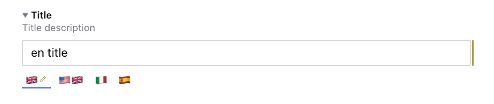
</p>

- [⚡️ Features](#%EF%B8%8F-features)
- [🔌 Installation](#-installation)
- [🧑‍💻 Usage](#-usage)
- [⚙️ Plugin Configuration](#%EF%B8%8F-plugin-configuration)
- [🔧 Field Configuration](#-field-configuration)
- [🗃️ Data Model](#%EF%B8%8F-data-model)
- [🚨 Validation](#-validation)
- [🤩 Examples Examples Examples](#-examples-examples-examples)
- [👀 Next Steps](#-next-steps)
- [📝 License](#-license)
- [🧪 Develop & test](#-develop-&-test)
<br />

## ⚡️ Features

- Sanity v3 plugin.
- Field level localization for the following Sanity types: `string`, `text`, and `number`.
- Optional UI (slider or dropdown).
- Locale visibility by user roles.
- Locale readonly by user roles.
- Object Validation.
- Customization available not only at the plugin level but also at field level.
<br />

## 🔌 Installation

```sh
npm install sanity-plugin-i18n-fields
```
<br />

## 🧑‍💻 Usage

Add it as a plugin in `sanity.config.ts` (or .js):

```ts
import {defineConfig} from 'sanity'
import {I18nFields} from 'sanity-plugin-i18n-fields'

export default defineConfig({
  //...
  plugins: [I18nFields({
    // your configuration here
  })],
})
```
The plugin will provide 3 new types: `i18n.string`, `i18n.text` and `i18n.number`. All 3 types will be objects with a dynamic number of fields based on the localizations provided during configuration.\
<br />

## ⚙️ Plugin Configuration
This is the main configuration of the plugin. The available options are the following:
```ts
{
  // the ui option it lets you play with the UI of the plugin.
  ui?: {
    type?: 'slider' | 'dropdown' // the ui of the plugin. Default is 'slider'
    position?: 'top' | 'bottom' // the position of the 'slider', above or below the input field. Default is 'bottom'
    selected?: 'border' | 'background' // the ui of the selected locale when type is 'slider'. Default is 'border'
  },
  // the locales option is the core of the configuration. It lets you configure all the available locales of your project.
  locales: [
    {
      code: string // the code of the locale
      label: ReactNode // the label of the locale
      title: string // the title of the locale
      default?: boolean // the flag to identify the default locale. If true, the locale is in the first position
      visibleFor?: string[] // List of roles for which this locale is visible. Using the '!' operator, it is possible to make it not visibile
      editableFor?: string[] // List of roles for which this locale is editable. Using the '!' operator, it is possible to do the opposite
    },
    // other locales
  ]
}
```
Sample configuration:
```ts
import {defineConfig} from 'sanity'
import {I18nFields} from 'sanity-plugin-i18n-fields'

export default defineConfig({
  //...
  plugins: [I18nFields({
    ui: {
      position: 'bottom'
    },
    locales: [
      {code: 'en', label: '🇬🇧', title: 'English', default: true},
      {code: 'en_us', label: '🇺🇸🇬🇧', title: 'American English'},
      {code: 'it', label: '🇮🇹', title: 'Italian', visibleFor: ['it_editor']}, // country visible only for administrator and it_editor roles
      {code: 'es', label: '🇪🇸', title: 'Spanish'},
    ]
  })],
})
```
<br />

## 🔧 Field Configuration
Other than a global configuration, you can tune your configuration at field level. For example for a specific field you can have a dropdown layout or you can hide a specific locale.
```ts
import {ConditionalProperty, NumberOptions, StringOptions} from 'sanity'

export default defineType({
  type: 'document',
  name: 'myDocument',
  title: 'My Document',
  fields: [
    defineField({
      type: 'i18n.string' | 'i18n.text' | 'i18n.number',
      // ...
      options: {
        ui?: {
          type?: 'slider' | 'dropdown'
          position?: 'top' | 'bottom'
          selected?: 'border' | 'background'
        },
        locales?: [
            {
              code: string // the code of the locale. MUST be the same of the one used in the global configuration
              readOnly?: ConditionalProperty
              hidden?: ConditionalProperty
              options?: StringOptions | { rows?:number } | NumberOptions
              visibleFor?: string[] // List of roles for which this locale is visible. Using the '!' operator, it is possible to make it not visibile
              editableFor?: string[] // List of roles for which this locale is editable. Using the '!' operator, it is possible to do the opposite
            },
            // other locales
          ]
      }
    })
  ]
})
```
<br />

## 🗃️ Data model
```ts
  // sample with 'en', 'en_us', 'it' and 'es' locales

  {
    _type: 'i18n.string',
    en: string,
    en_us: string,
    it: string,
    es: string,
  }

  {
    _type: 'i18n.text',
    en: string,
    en_us: string,
    it: string,
    es: string,
  }

  {
    _type: 'i18n.number',
    en: number,
    en_us: number,
    it: number,
    es: number,
  }
```
<br />

## 🚨 Validation
Since the new types introduced by the plugin are objects, you can use [children validation](https://www.sanity.io/docs/validation#9e69d5db6f72) to address specific validation on a specific locale.
All error/warning messages are then collected and visible near the title of your field or in the right menu.

<p align="center">
  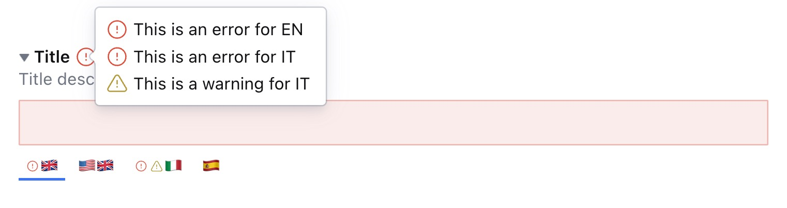
</p>
<p align="center">
  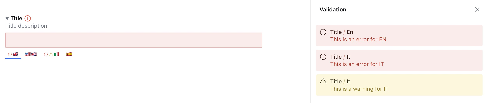
</p>
<br />

## 🤩 Examples Examples Examples

- [Basic Configuration](#example-basic-configuration)
- [Global user roles visibility](#example-global-user-roles-visibility)
- [String field](#example-string-field)
- [Text field](#example-text-field)
- [Number field](#example-number-field)
- [Slider top position](#example-slider-top-position)
- [Slider with background option](#example-slider-with-background-ui-option)
- [Dropdown UI](#example-dropdown-ui)
- [Multiple UI on different fields](#example-multiple-ui-on-different-fields)
- [Hide specific locale for a single field](#example-hide-specific-locale-for-a-single-field)
- [Locale not editable for a specific field](#example-locale-not-editable-for-a-specific-field)
- [Conditionally set a locale visible or not editable](#example-conditionally-set-a-locale-visible-or-not-editable)
- [List of values](#example-list-of-values)
- [Global validation](#example-global-validation)
- [Children validation](#example-children-validation)
- [Alternative locale label](#example-alternative-locale-label)
- [Alternative locale label 2](#example-alternative-locale-label-2)

### Example: Basic Configuration
```ts
  I18nFields({
    locales: [
      {code: 'en', label: '🇬🇧', title: 'English', default: true},
      {code: 'en_us', label: '🇺🇸🇬🇧', title: 'American English'},
      {code: 'it', label: '🇮🇹', title: 'Italian'},
      {code: 'es', label: '🇪🇸', title: 'Spanish'},
    ]
  })
```

---

### Example: Global User Roles Visibility
```ts
  I18nFields({
    locales: [
      {code: 'en', label: '🇬🇧', title: 'English', default: true},
      {code: 'en_us', label: '🇺🇸🇬🇧', title: 'American English', visibleFor: ['us_editor']}, // visible only for administrator and us_editor roles
      {code: 'it', label: '🇮🇹', title: 'Italian', editableFor: ['it_editor']}, // visible for everyone but editable only for administrator and it_editor roles.
      {code: 'es', label: '🇪🇸', title: 'Spanish', editableFor: ['!movie_editor']}, // visible and editable for everyone. It will be readonly for movie_editor role.
    ]
  })
```

---

### Example: String Field
```ts
  defineField({
    type: 'i18n.string',
    name: 'title',
    title: 'Title',
    description: 'Title description',
  })
```
<p align="center">
  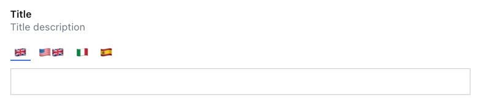
</p>

---

### Example: Text Field
```ts
  defineField({
    type: 'i18n.text',
    name: 'title',
    title: 'Title',
    description: 'Title description',
  })
```
<p align="center">
  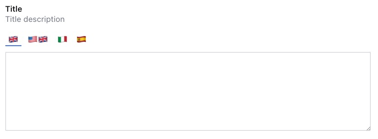
</p>

---

### Example: Number Field
```ts
  defineField({
    type: 'i18n.number',
    name: 'title',
    title: 'Title',
    description: 'Title description',
  })
```
<p align="center">
  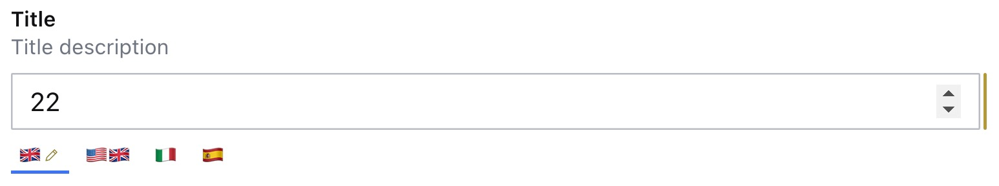
</p>

---

### Example: Slider top position
```ts
  I18nFields({
    ui: {
      position: 'top'
    },
    locales: [
      {code: 'en', label: '🇬🇧', title: 'English', default: true},
      {code: 'en_us', label: '🇺🇸🇬🇧', title: 'American English'},
      {code: 'it', label: '🇮🇹', title: 'Italian'},
      {code: 'es', label: '🇪🇸', title: 'Spanish'},
    ]
  })
```
<p align="center">
  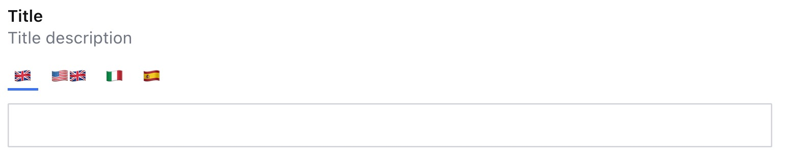
</p>

---

### Example: Slider with background UI option
```ts
  I18nFields({
    ui: {
      selected: 'background'
    },
    locales: [
      {code: 'en', label: '🇬🇧', title: 'English', default: true},
      {code: 'en_us', label: '🇺🇸🇬🇧', title: 'American English'},
      {code: 'it', label: '🇮🇹', title: 'Italian'},
      {code: 'es', label: '🇪🇸', title: 'Spanish'},
    ]
  })
```
<p align="center">
  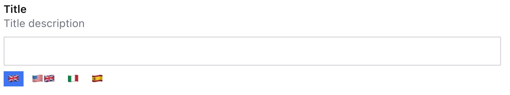
</p>

---

### Example: Dropdown UI
```ts
  I18nFields({
    ui: {
      type: 'dropdown'
    },
    locales: [
      {code: 'en', label: '🇬🇧', title: 'English', default: true},
      {code: 'en_us', label: '🇺🇸🇬🇧', title: 'American English'},
      {code: 'it', label: '🇮🇹', title: 'Italian'},
      {code: 'es', label: '🇪🇸', title: 'Spanish'},
    ]
  })
```
<p align="center">
  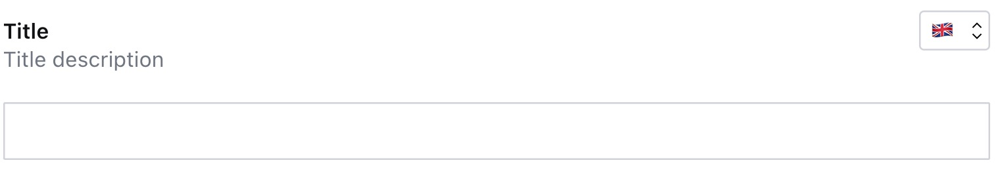
</p>

---

### Example: Multiple UI on different fields
```ts
export default defineType({
  type: 'document',
  name: 'testDocument',
  title: 'Test Document',
  fields: [
    defineField({
      type: 'i18n.string',
      name: 'field1',
      title: 'Field 1',
    }),
    defineField({
      type: 'i18n.string',
      name: 'field2',
      title: 'Field 2',
      options: {
        ui: {
          position: 'top',
          selected: 'background'
        }
      }
    }),
    defineField({
      type: 'i18n.string',
      name: 'field3',
      title: 'Field 3',
      options: {
        ui: {
          type: 'dropdown'
        }
      }
    })
  ]
})
```
<p align="center">
  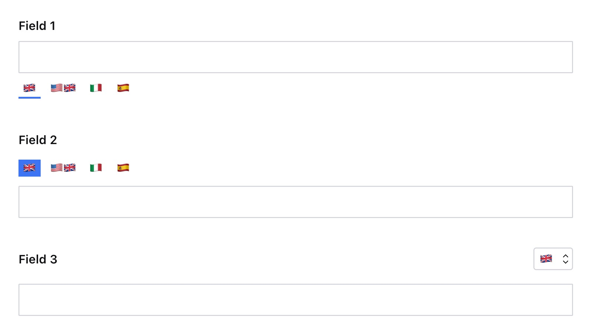
</p>

---

### Example: Hide specific locale for a single field
```ts
  defineField({
    type: 'i18n.string',
    name: 'field1',
    title: 'Field 1',
    options: {
      locales: [{
        code: 'it',
        hidden: true
      }]
    }
  }),
```
<p align="center">
  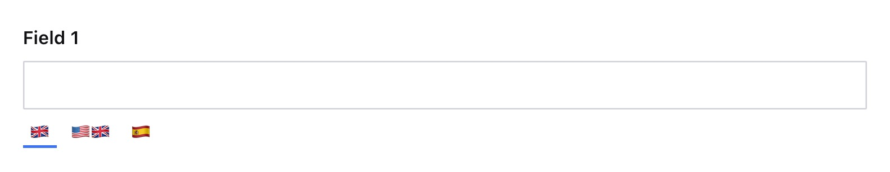
</p>

---

### Example: Locale not editable for a specific field
```ts
  defineField({
    type: 'i18n.string',
    name: 'field1',
    title: 'Field 1',
    options: {
      locales: [{
        code: 'en',
        readOnly: true
      }]
    }
  }),
```
<p align="center">
  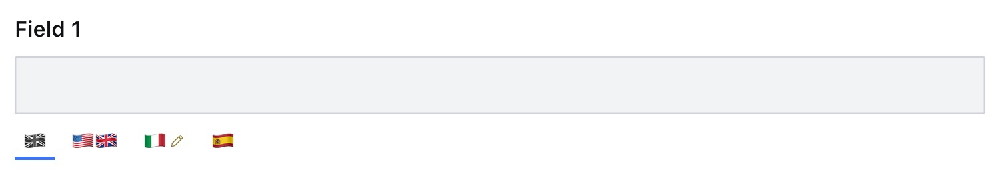
</p>

---

### Example: Conditionally set a locale visible or not editable
```ts
  defineField({
    type: 'i18n.string',
    name: 'field1',
    title: 'Field 1',
    options: {
      locales: [
        {
          code: 'it',
          hidden: ({value}) => {
            return value?.en === 'pizza with 🍍' ? true : false
          },
        },
        {
          code: 'en',
          readOnly: ({value}) => {
            return value?.it === 'pizza' ? true : false
          },
        },
      ],
    },
  }),
```

---

### Example: List of values
```ts
  const levelList = [
    {value: undefined, title: 'No Value'},
    {value: 1, title: 'Level 1'},
    {value: 1, title: 'Level 2'},
    {value: 3, title: 'Level 3'},
  ]

  defineField({
    type: 'i18n.number',
    name: 'field3',
    title: 'Field 3',
    options: {
      locales: [
        {
          code: 'en',
          options: {
            list: levelList,
            layout: 'radio',
          },
        },
      ],
    },
  }),
```
<p align="center">
  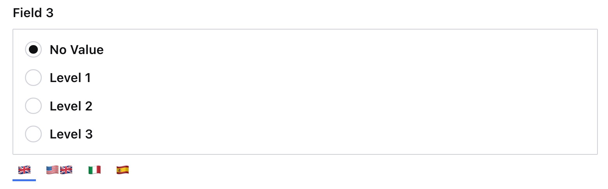
</p>

---

### Example: Global Validation
```ts
  defineField({
    type: 'i18n.string',
    name: 'field3',
    title: 'Field 3',
    validation: (Rule) => Rule.required(),
  }),
```
<p align="center">
  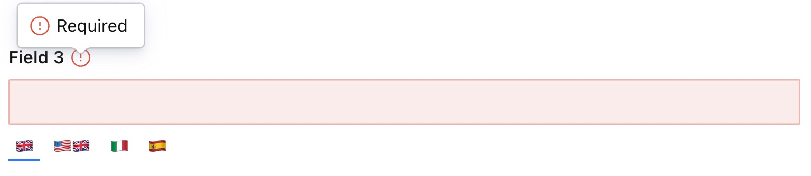
</p>

---

### Example: Children Validation
```ts
  defineField({
    type: 'i18n.string',
    name: 'field2',
    title: 'Field 2',
    validation: (Rule) =>
      Rule.custom((value) => {
        return (
          value?.en !== 'fast' || {
            message: `You can't use the word 'fast' for en locale`,
            paths: [['en']],
          }
        )
      }),
  }),
```
<p align="center">
  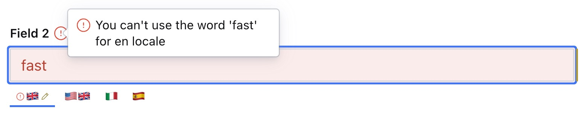
</p>

---

### Example: Alternative Locale Label
```ts
  I18nFields({
    locales: [
      {code: 'en', label: 'EN', title: 'English', default: true},
      {code: 'en_us', label: 'EN-US', title: 'American English'},
      {code: 'it', label: 'IT', title: 'Italian'},
      {code: 'es', label: 'ES', title: 'Spanish'},
    ]
  })
```
<p align="center">
  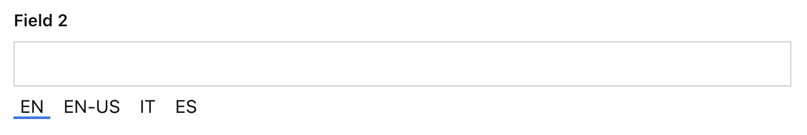
</p>

---

### Example: Alternative Locale Label 2
```ts
  import {FaPizzaSlice} from 'react-icons/fa'
  import {GiTeapot, GiBull, GiAmericanFootballBall} from 'react-icons/gi'
  I18nFields({
    locales: [
      {code: 'en', label: GiTeapot, title: 'English', default: true},
      {code: 'en_us', label: GiAmericanFootballBall, title: 'American English'},
      {code: 'it', label: FaPizzaSlice, title: 'Italian'},
      {code: 'es', label: GiBull, title: 'Spanish'},
    ]
  })
```
<p align="center">
  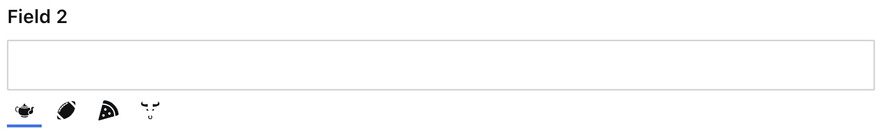
</p>
<br />

## 👀 Next Steps
TODO
<br />

## License

[MIT](LICENSE) © William Iommi

## Develop & test

This plugin uses [@sanity/plugin-kit](https://github.com/sanity-io/plugin-kit)
with default configuration for build & watch scripts.

See [Testing a plugin in Sanity Studio](https://github.com/sanity-io/plugin-kit#testing-a-plugin-in-sanity-studio)
on how to run this plugin with hotreload in the studio.


### Release new version

Run ["CI & Release" workflow](https://github.com/williamiommi/sanity-plugin-i18n-fields/actions/workflows/main.yml).
Make sure to select the main branch and check "Release new version".

Semantic release will only release on configured branches, so it is safe to run release on any branch.
