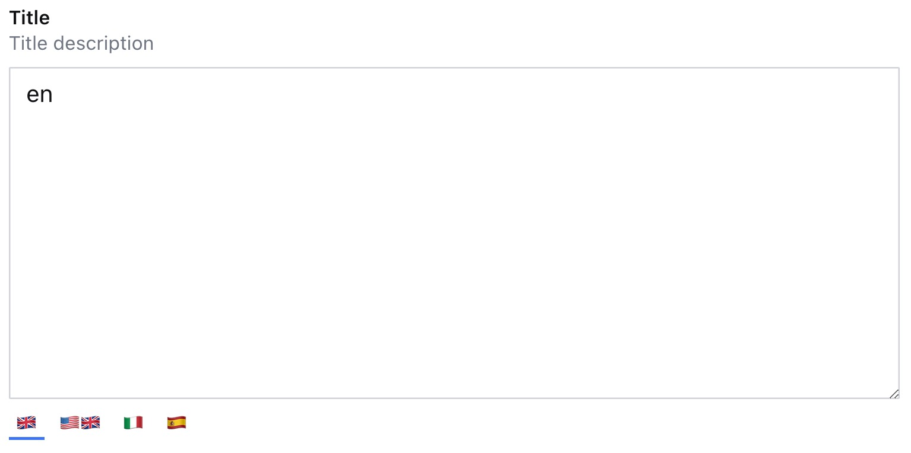
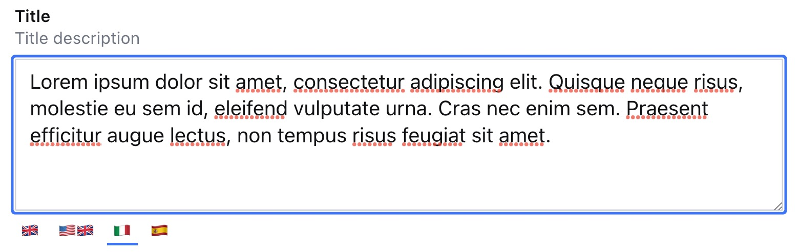

# 🌍 i18n fields

An alternative way to manage localization at field level in your Sanity Studio.

<p align="center">
  
</p>

- [⚡️ Features](#%EF%B8%8F-features)
- [🔌 Installation](#-installation)
- [🧑‍💻 Usage](#-usage)
- [⚙️ Plugin Configuration](#%EF%B8%8F-plugin-configuration)
- [🔧 Field Configuration](#-field-configuration)
- [🗃️ Data Model](#%EF%B8%8F-data-model)
- [🚨 Validation](#-validation)
- [🤩 Examples Examples Examples](#-examples-examples-examples)
- [👀 Future features](#-future-features)
- [📝 License](#-license)
- [🧪 Develop & test](#-develop--test)
<br />

## ⚡️ Features

- Sanity v3 plugin.
- Field-level localization for the following Sanity types: string, text, and number.
- Optional UI (slider or dropdown).
- Locale visibility by user roles.
- Locale read-only by user roles.
- Object Validation.
- Customization available not only at plugin level but also at field level.
- Customizable types prefix.
<br />

## 🔌 Installation

```sh
npm install sanity-plugin-i18n-fields
```
<br />

## 🧑‍💻 Usage

Add it as a plugin in `sanity.config.ts` (or .js):

```ts
import {defineConfig} from 'sanity'
import {I18nFields} from 'sanity-plugin-i18n-fields'

export default defineConfig({
  //...
  plugins: [I18nFields({
    // your configuration here
  })],
})
```
The plugin will provide three new types: `i18n.string`, `i18n.text`, and `i18n.number`. All three types will be objects with a dynamic number of fields based on the localizations provided during configuration.
<br />

## ⚙️ Plugin Configuration
This is the main configuration of the plugin, and the available options are as follows:
```ts
{
  prefix?: string // You can configure the prefix of the types created by the plugin. If you are already using them or prefer a different name for any reason, you can change it. The default is 'i18n'.
  // The 'ui' option allows you to customize the appearance of the plugin's UI. By default, it is set to 'slider'.
  ui?: {
    type?: 'slider' | 'dropdown' // The UI of the plugin, Default is 'slider'
    position?: 'top' | 'bottom' // You can specify the position of the 'slider' above or below the input field, with the default being 'bottom'.
    selected?: 'border' | 'background' // For the 'slider' type, you can configure the UI of the selected locale, and the default setting is 'border'.
  },
  // The 'locales' option is the core of the configuration, enabling you to set up all available locales for your project.
  locales: [
    {
      code: string // the code of the locale
      label: ReactNode // the label of the locale
      title: string // the title of the locale
      default?: boolean // This is the flag to identify the default locale. If set to true, the locale is placed in the first position.
      visibleFor?: string[] // You can define a list of roles for which this locale is visible. By using the '!' operator, you can make it not visible.
      editableFor?: string[] // You can define a list of roles for which this locale is editable. The '!' operator allows you to specify the opposite condition.
    },
    // other locales
  ]
}
```
Sample configuration:
```ts
import {defineConfig} from 'sanity'
import {I18nFields} from 'sanity-plugin-i18n-fields'

export default defineConfig({
  //...
  plugins: [I18nFields({
    ui: {
      position: 'bottom'
    },
    locales: [
      {code: 'en', label: '🇬🇧', title: 'English', default: true},
      {code: 'en_us', label: '🇺🇸🇬🇧', title: 'American English'},
      {code: 'it', label: '🇮🇹', title: 'Italian', visibleFor: ['it_editor']}, // country visible only for administrator and it_editor roles
      {code: 'es', label: '🇪🇸', title: 'Spanish'},
    ]
  })],
})
```
<br />

## 🔧 Field Configuration
Other than global configuration, you can customize your configuration at field level. For example, for a specific field, you can have a dropdown layout or hide a particular locale.
```ts
import {ConditionalProperty, NumberOptions, StringOptions} from 'sanity'

export default defineType({
  type: 'document',
  name: 'myDocument',
  title: 'My Document',
  fields: [
    defineField({
      type: 'i18n.string' | 'i18n.text' | 'i18n.number',
      // ...
      options: {
        ui?: {
          type?: 'slider' | 'dropdown'
          position?: 'top' | 'bottom'
          selected?: 'border' | 'background'
        },
        locales?: [
            {
              code: string // the code of the locale. MUST be the same as the one used in the global configuration.
              readOnly?: ConditionalProperty
              hidden?: ConditionalProperty
              options?: StringOptions | { rows?:number } | NumberOptions
              visibleFor?: string[] // same as global configuration
              editableFor?: string[] // same as global configuration
            },
            // other locales
          ]
      }
    })
  ]
})
```
<br />

## 🗃️ Data model
```ts
  // sample with 'en', 'en_us', 'it' and 'es' locales

  {
    _type: 'i18n.string',
    en: string,
    en_us: string,
    it: string,
    es: string,
  }

  {
    _type: 'i18n.text',
    en: string,
    en_us: string,
    it: string,
    es: string,
  }

  {
    _type: 'i18n.number',
    en: number,
    en_us: number,
    it: number,
    es: number,
  }
```
<br />

## 🚨 Validation
Since the new types introduced by the plugin are objects, you can use [children validation](https://www.sanity.io/docs/validation#9e69d5db6f72) to apply specific validation to a particular locale.
All error/warning messages are then collected and visible near the title of your field or in the right menu.

<p align="center">
  
</p>
<p align="center">
  
</p>
<br />

## 🤩 Examples Examples Examples

- [Basic Configuration](#example-basic-configuration)
- [Global user roles visibility](#example-global-user-roles-visibility)
- [String field](#example-string-field)
- [Text field](#example-text-field)
- [Number field](#example-number-field)
- [Slider top position](#example-slider-top-position)
- [Slider with background option](#example-slider-with-background-ui-option)
- [Dropdown UI](#example-dropdown-ui)
- [Multiple UI on different fields](#example-multiple-ui-on-different-fields)
- [Hide specific locale for a single field](#example-hide-specific-locale-for-a-single-field)
- [Locale not editable for a specific field](#example-locale-not-editable-for-a-specific-field)
- [Conditionally set a locale visible or not editable](#example-conditionally-set-a-locale-visible-or-not-editable)
- [List of values](#example-list-of-values)
- [Custom rows for i18n.text](#example-custom-rows-for-i18ntext)
- [Global validation](#example-global-validation)
- [Children validation](#example-children-validation)
- [Alternative locale label](#example-alternative-locale-label)
- [Alternative locale label 2](#example-alternative-locale-label-2)
- [Customized prefix](#example-customized-prefix)

### Example: Basic Configuration
```ts
  I18nFields({
    locales: [
      {code: 'en', label: '🇬🇧', title: 'English', default: true},
      {code: 'en_us', label: '🇺🇸🇬🇧', title: 'American English'},
      {code: 'it', label: '🇮🇹', title: 'Italian'},
      {code: 'es', label: '🇪🇸', title: 'Spanish'},
    ]
  })
```

---

### Example: Global User Roles Visibility
```ts
  I18nFields({
    locales: [
      {code: 'en', label: '🇬🇧', title: 'English', default: true},
      {code: 'en_us', label: '🇺🇸🇬🇧', title: 'American English', visibleFor: ['us_editor']}, // visible only for administrator and us_editor roles
      {code: 'it', label: '🇮🇹', title: 'Italian', editableFor: ['it_editor']}, // visible for everyone but editable only for administrator and it_editor roles.
      {code: 'es', label: '🇪🇸', title: 'Spanish', editableFor: ['!movie_editor']}, // visible and editable for everyone. It will be readonly for movie_editor role.
    ]
  })
```

---

### Example: String Field
```ts
  defineField({
    type: 'i18n.string',
    name: 'title',
    title: 'Title',
    description: 'Title description',
  })
```
<p align="center">
  
</p>

---

### Example: Text Field
```ts
  defineField({
    type: 'i18n.text',
    name: 'title',
    title: 'Title',
    description: 'Title description',
  })
```
<p align="center">
  
</p>

---

### Example: Number Field
```ts
  defineField({
    type: 'i18n.number',
    name: 'title',
    title: 'Title',
    description: 'Title description',
  })
```
<p align="center">
  
</p>

---

### Example: Slider top position
```ts
  I18nFields({
    ui: {
      position: 'top'
    },
    locales: [
      {code: 'en', label: '🇬🇧', title: 'English', default: true},
      {code: 'en_us', label: '🇺🇸🇬🇧', title: 'American English'},
      {code: 'it', label: '🇮🇹', title: 'Italian'},
      {code: 'es', label: '🇪🇸', title: 'Spanish'},
    ]
  })
```
<p align="center">
  
</p>

---

### Example: Slider with background UI option
```ts
  I18nFields({
    ui: {
      selected: 'background'
    },
    locales: [
      {code: 'en', label: '🇬🇧', title: 'English', default: true},
      {code: 'en_us', label: '🇺🇸🇬🇧', title: 'American English'},
      {code: 'it', label: '🇮🇹', title: 'Italian'},
      {code: 'es', label: '🇪🇸', title: 'Spanish'},
    ]
  })
```
<p align="center">
  
</p>

---

### Example: Dropdown UI
```ts
  I18nFields({
    ui: {
      type: 'dropdown'
    },
    locales: [
      {code: 'en', label: '🇬🇧', title: 'English', default: true},
      {code: 'en_us', label: '🇺🇸🇬🇧', title: 'American English'},
      {code: 'it', label: '🇮🇹', title: 'Italian'},
      {code: 'es', label: '🇪🇸', title: 'Spanish'},
    ]
  })
```
<p align="center">
  
</p>

---

### Example: Multiple UI on different fields
```ts
export default defineType({
  type: 'document',
  name: 'testDocument',
  title: 'Test Document',
  fields: [
    defineField({
      type: 'i18n.string',
      name: 'field1',
      title: 'Field 1',
    }),
    defineField({
      type: 'i18n.string',
      name: 'field2',
      title: 'Field 2',
      options: {
        ui: {
          position: 'top',
          selected: 'background'
        }
      }
    }),
    defineField({
      type: 'i18n.string',
      name: 'field3',
      title: 'Field 3',
      options: {
        ui: {
          type: 'dropdown'
        }
      }
    })
  ]
})
```
<p align="center">
  
</p>

---

### Example: Hide specific locale for a single field
```ts
  defineField({
    type: 'i18n.string',
    name: 'field1',
    title: 'Field 1',
    options: {
      locales: [{
        code: 'it',
        hidden: true
      }]
    }
  }),
```
<p align="center">
  
</p>

---

### Example: Locale not editable for a specific field
```ts
  defineField({
    type: 'i18n.string',
    name: 'field1',
    title: 'Field 1',
    options: {
      locales: [{
        code: 'en',
        readOnly: true
      }]
    }
  }),
```
<p align="center">
  
</p>

---

### Example: Conditionally set a locale visible or not editable
```ts
  defineField({
    type: 'i18n.string',
    name: 'field1',
    title: 'Field 1',
    options: {
      locales: [
        {
          code: 'it',
          hidden: ({value}) => {
            return value?.en === 'pizza with 🍍' ? true : false
          },
        },
        {
          code: 'en',
          readOnly: ({value}) => {
            return value?.it === 'pizza' ? true : false
          },
        },
      ],
    },
  }),
```

---

### Example: List of values
```ts
  const levelList = [
    {value: undefined, title: 'No Value'},
    {value: 1, title: 'Level 1'},
    {value: 1, title: 'Level 2'},
    {value: 3, title: 'Level 3'},
  ]

  defineField({
    type: 'i18n.number',
    name: 'field3',
    title: 'Field 3',
    options: {
      locales: [
        {
          code: 'en',
          options: {
            list: levelList,
            layout: 'radio',
          },
        },
      ],
    },
  }),
```
<p align="center">
  
</p>

---

### Example: Custom rows for i18n.text
```ts
  defineField({
    type: 'i18n.text',
    name: 'title',
    title: 'Title',
    description: 'Title description',
    options: {
      rows: 10,
      locales: [
        {
          code: 'it',
          options: {
            rows: 5,
          },
        },
      ],
    },
  }),
```
<p align="center">
  
  
</p>

---

### Example: Global Validation
```ts
  defineField({
    type: 'i18n.string',
    name: 'field3',
    title: 'Field 3',
    validation: (Rule) => Rule.required(),
  }),
```
<p align="center">
  
</p>

---

### Example: Children Validation
```ts
  defineField({
    type: 'i18n.string',
    name: 'field2',
    title: 'Field 2',
    validation: (Rule) =>
      Rule.custom((value) => {
        return (
          value?.en !== 'fast' || {
            message: `You can't use the word 'fast' for en locale`,
            paths: [['en']],
          }
        )
      }),
  }),
```
<p align="center">
  
</p>

---

### Example: Alternative Locale Label
```ts
  I18nFields({
    locales: [
      {code: 'en', label: 'EN', title: 'English', default: true},
      {code: 'en_us', label: 'EN-US', title: 'American English'},
      {code: 'it', label: 'IT', title: 'Italian'},
      {code: 'es', label: 'ES', title: 'Spanish'},
    ]
  })
```
<p align="center">
  
</p>

---

### Example: Alternative Locale Label 2
```ts
  import {FaPizzaSlice} from 'react-icons/fa'
  import {GiTeapot, GiBull, GiAmericanFootballBall} from 'react-icons/gi'
  I18nFields({
    locales: [
      {code: 'en', label: GiTeapot, title: 'English', default: true},
      {code: 'en_us', label: GiAmericanFootballBall, title: 'American English'},
      {code: 'it', label: FaPizzaSlice, title: 'Italian'},
      {code: 'es', label: GiBull, title: 'Spanish'},
    ]
  })
```
<p align="center">
  
</p>

---

### Example: Customized prefix
```ts
  I18nFields({
    prefix: 'myAwesomePrefix',
    locales: [
      {code: 'en', label: '🇬🇧', title: 'English', default: true},
      {code: 'en_us', label: '🇺🇸🇬🇧', title: 'American English'},
      {code: 'it', label: '🇮🇹', title: 'Italian'},
      {code: 'es', label: '🇪🇸', title: 'Spanish'},
    ]
  })
```
As result of this customization, instead of having the default types, you are going to have the following ones:

- `myAwesomePrefix.string`
- `myAwesomePrefix.text`
- `myAwesomePrefix.number`

You are going to lose typescript definitions since you are not using `ì18n.string`, `ì18n.text` or `i18n.number` types, but you can override in your project doing something like this:

```ts
//custom.types.d.ts

import {
  I18nNumberDefinition,
  I18nStringDefinition,
  I18nTextDefinition,
} from 'sanity-plugin-i18n-fields'

declare module 'sanity' {
  export interface IntrinsicDefinitions {
    'myAwesomePrefix.string': Omit<I18nStringDefinition, 'type'> & {type: 'myAwesomePrefix.string'}
  }
  export interface IntrinsicDefinitions {
    'myAwesomePrefix.text': Omit<I18nTextDefinition, 'type'> & {type: 'myAwesomePrefix.text'}
  }
  export interface IntrinsicDefinitions {
    'myAwesomePrefix.number': Omit<I18nNumberDefinition, 'type'> & {type: 'myAwesomePrefix.number'}
  }
}
```
<br />

## 👀 Future features
- New Sanity default types (boolean, date...)
- Filters
  - Show all locales without slider/dropdown
  - Show only fulfilled translations
  - Show only empty translations
- AI integration? 🤔
- ...
<br /><br />

> While writing this documentation, I realized that with the 'prefix' option, you can define the plugin multiple times with different prefixes.\
> Codes and Labels are customizable, and this plugin could be used for other use cases, not only for internationalization.\
> So, perhaps the name 'I18N Fields' is already outdated? 😅 Should I find a different name? Any suggestions? 😂

<br /><br />

## 📝 License

[MIT](LICENSE) © William Iommi
<br />

## 🧪 Develop & test

This plugin uses [@sanity/plugin-kit](https://github.com/sanity-io/plugin-kit)
with default configuration for build & watch scripts.

See [Testing a plugin in Sanity Studio](https://github.com/sanity-io/plugin-kit#testing-a-plugin-in-sanity-studio)
on how to run this plugin with hotreload in the studio.


### Release new version

Run ["CI & Release" workflow](https://github.com/williamiommi/sanity-plugin-i18n-fields/actions/workflows/main.yml).
Make sure to select the main branch and check "Release new version".

Semantic release will only release on configured branches, so it is safe to run release on any branch.
