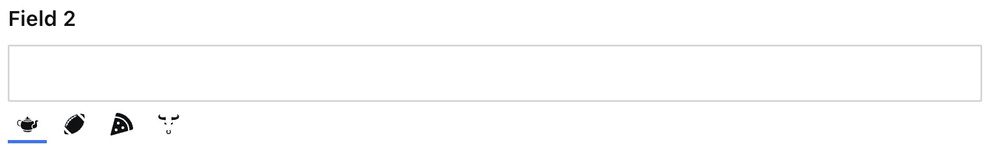

### Example: Alternative Locale Label 2
```ts
  import {FaPizzaSlice} from 'react-icons/fa'
  import {GiTeapot, GiBull, GiAmericanFootballBall} from 'react-icons/gi'

  I18nFields({
    locales: [
      {code: 'en', label: GiTeapot, title: 'English', default: true},
      {code: 'en_us', label: GiAmericanFootballBall, title: 'American English'},
      {code: 'it', label: FaPizzaSlice, title: 'Italian'},
      {code: 'es', label: GiBull, title: 'Spanish'},
    ]
  })
```
<p align="center">
  
</p>