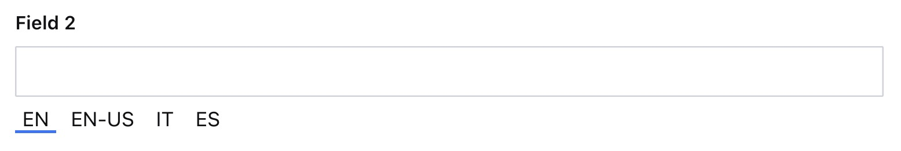

### Example: Alternative Locale Label
```ts
  I18nFields({
    locales: [
      {code: 'en', label: 'EN', title: 'English', default: true},
      {code: 'en_us', label: 'EN-US', title: 'American English'},
      {code: 'it', label: 'IT', title: 'Italian'},
      {code: 'es', label: 'ES', title: 'Spanish'},
    ]
  })
```
<p align="center">
  
</p>