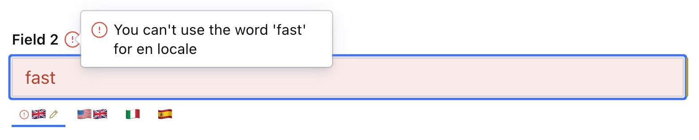

### Example: Children Validation
```ts
  defineField({
    type: 'i18n.string',
    name: 'field2',
    title: 'Field 2',
    validation: (Rule) =>
      Rule.custom((value) => {
        return (
          value?.en !== 'fast' || {
            message: `You can't use the word 'fast' for en locale`,
            paths: [['en']],
          }
        )
      }),
  }),
```
<p align="center">
  
</p>