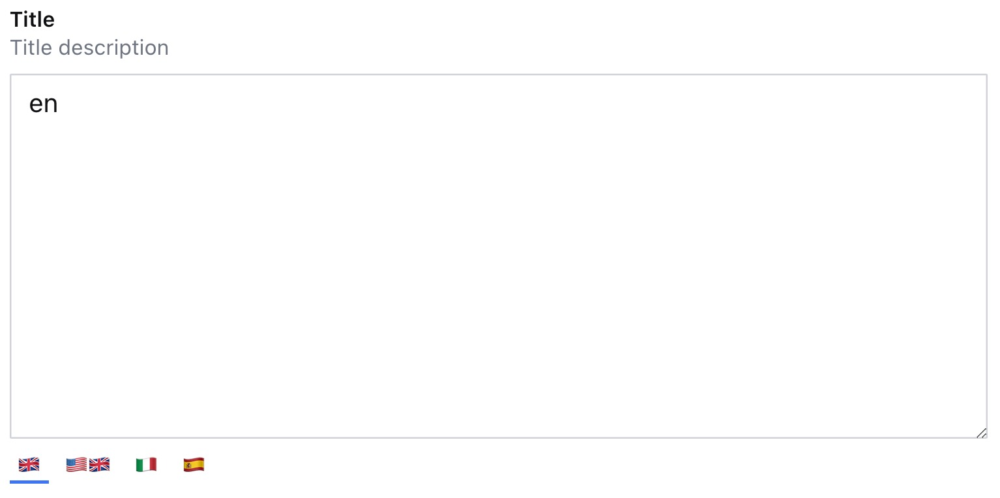
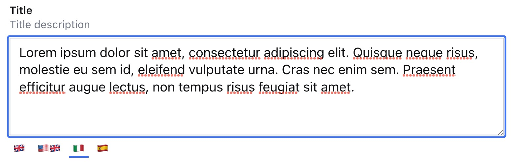

### Example: Custom rows for i18n.text
```ts
  defineField({
    type: 'i18n.text',
    name: 'title',
    title: 'Title',
    description: 'Title description',
    options: {
      rows: 10,
      locales: [
        {
          code: 'it',
          options: {
            rows: 5,
          },
        },
      ],
    },
  }),
```
<p align="center">
  
  
</p>