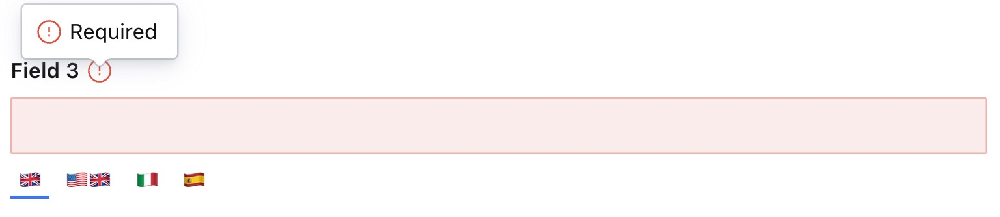

### Example: Global Validation
```ts
  defineField({
    type: 'i18n.string',
    name: 'field3',
    title: 'Field 3',
    validation: (Rule) => Rule.required(),
  }),
```
<p align="center">
  
</p>