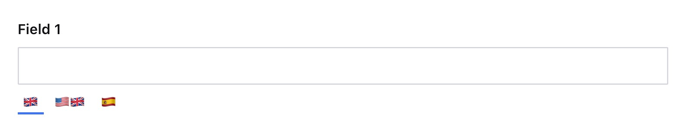

### Example: Hide specific locale for a single field
```ts
  defineField({
    type: 'i18n.string',
    name: 'field1',
    title: 'Field 1',
    options: {
      locales: [{
        code: 'it',
        hidden: true
      }]
    }
  }),
```
<p align="center">
  
</p>