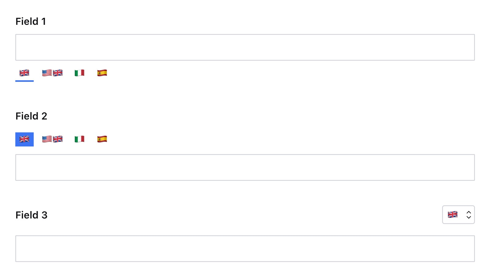

### Example: Multiple UI on different fields
```ts
export default defineType({
  type: 'document',
  name: 'testDocument',
  title: 'Test Document',
  fields: [
    defineField({
      type: 'i18n.string',
      name: 'field1',
      title: 'Field 1',
    }),
    defineField({
      type: 'i18n.string',
      name: 'field2',
      title: 'Field 2',
      options: {
        ui: {
          position: 'top',
          selected: 'background'
        }
      }
    }),
    defineField({
      type: 'i18n.string',
      name: 'field3',
      title: 'Field 3',
      options: {
        ui: {
          type: 'dropdown'
        }
      }
    })
  ]
})
```
<p align="center">
  
</p>