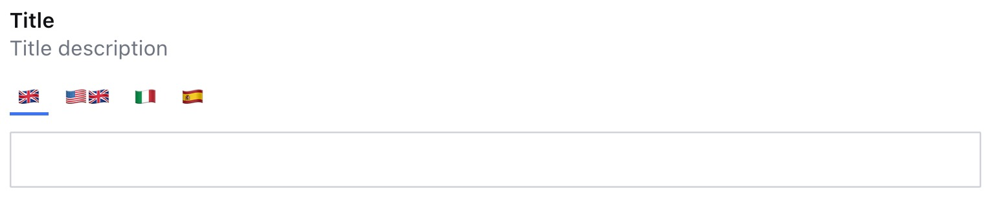

### Example: Slider top position
```ts
  I18nFields({
    ui: {
      position: 'top'
    },
    locales: [
      {code: 'en', label: '🇬🇧', title: 'English', default: true},
      {code: 'en_us', label: '🇺🇸🇬🇧', title: 'American English'},
      {code: 'it', label: '🇮🇹', title: 'Italian'},
      {code: 'es', label: '🇪🇸', title: 'Spanish'},
    ]
  })
```
<p align="center">
  
</p>